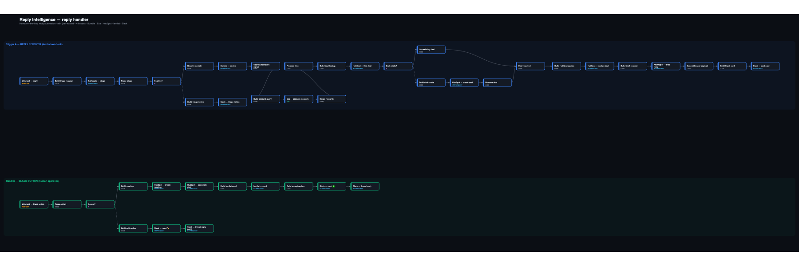

# Reply Intelligence

**The reply is the highest-intent moment in outbound — and it's where deals quietly die in a human queue.** This handles it: a prospect replies, it gets triaged, the account gets enriched, a calendar-aware reply gets drafted, a HubSpot deal + meeting get created, and the reply gets sent — with a human approving every send.

> 🎥 **Loom — a silent screen-capture of it actually working:** `‹add link›`  *(no voiceover; the narration is right here in text — read along)*
> 🔧 **It runs live** on self-hosted n8n against **real** HubSpot, lemlist, Sumble, Exa, Anthropic and Slack — no mocks. Importable workflow + diagram below.

**What the Loom shows (read along):**
1. **The Slack approval card** a real reply produced — account tier (Sumble), the prospect's reply, Exa research, the proposed time, and Claude's draft. *It drafted; it did not send.*
2. **The n8n run** that produced it — reply → triage → enrich → find/create HubSpot deal → draft → post → **stops at the human gate**.
3. **[✅ Accept & send]** clicked.
4. **The HubSpot meeting** — created and associated to the deal. *(No calendar integration by design — HubSpot↔Google Workspace should own the actual invite; I'd verify that mapping at Duvo rather than rebuild it.)*
5. **The reply actually sent** in lemlist — on the prospect's channel (works across email / LinkedIn / WhatsApp).
6. **The Slack thread** — ✅ reaction + an "Accepted" confirmation; the card is kept, not replaced.

*The one thing you can't see on camera is the reply-detection lag — that's lemlist's mailbox poll (same across channels). The honest limits and a week-one roadmap are at the bottom.*

---

## The note (read this first)

Hi Tom — you said pick something slow and manual that drives me a bit mad, fix it, and show you. So here it is, on your stack.

**What drives me mad: the *reply* step.** We spend real money to get a prospect to reply, and then it drops into a human queue — someone reads it, decides if it's real, digs up who the account is, writes a response, picks a time, books the meeting, updates the CRM. It's the highest-intent moment in the funnel and it's held together with browser tabs and copy-paste. Most "reply automation" either does nothing useful or auto-sends something embarrassing to a live buyer.

**What I built: a reply handler.** A prospect replies in lemlist → Claude triages it → the *account* gets enriched (Sumble technographics → a tier, Exa → what's actually going on there) → a HubSpot deal is found-or-created → a calendar-aware reply is drafted → an approval card lands in Slack. The AE reads it and clicks. **[✅ Accept]** books the HubSpot meeting, associates it to the deal, and sends the reply through lemlist. **[✏️ Edit]** deep-links straight to that exact conversation in lemlist. Nothing reaches the prospect, and no meeting is booked, until a human clicks.

**The calls I made:**

- **Human in the loop on the *send*, automation on everything else.** The expensive mistake is an AI reply hitting a real buyer. So the AI does all the grunt work — triage, enrich, draft, propose a time, stage the deal — and the human keeps the one decision that's actually theirs: hit send. That's deliberate, not a v1 shortcut. It's also where I'd keep it even at scale.
- **Enrich the account, not the email.** A buyer replies from a gmail address; that tells you nothing. I enrich the *company* (Sumble + Exa, keyed off the account domain), so the tier is real even when the from-address is a personal inbox. P&G's reply comes back 🟢 HOT with their RPA stack; About You comes back cooler because it genuinely has no RPA footprint — the scoring discriminates instead of rubber-stamping everyone.
- **Use the platform's real primitives, honestly.** HubSpot's native node has no *meetings* resource and lemlist's has no *inbox* — I checked the catalog rather than guessing — so those are credentialed HTTP calls against the real APIs (each still carrying its real encrypted credential). Exa uses its native node. I reach for the right call, not the pretty one.
- **It actually runs.** Real deals and meetings created in HubSpot, real replies sent through lemlist, on self-hosted n8n. The Loom shows a reply going in and a booked meeting coming out.

**Where I deliberately stopped: Gong.** The honest biggest gap is the *call → CRM* loop. Reply-time MEDDPICC is what the *prospect typed*, not what happened on the call. Closing that with Gong is the first thing I'd build in the seat — details in [Where it breaks](#where-it-breaks-being-honest).

— Jan

---

## Why this

Signal detection, enrichment, scoring, routing — they all converge on the same moment: **a human now has to do something with a reply.** That's the bottleneck I keep hitting. Enrichment that fires three minutes too late, a tier nobody reads, a great reply that sits unanswered for a day because the rep was on a call. The work isn't hard; it's just *manual and serialized*, and it happens at the exact point where speed and judgment both matter most.

So I automated the parts that are judgment-free (read the reply, classify intent, pull the account picture, draft, find the deal, propose a time) and put a hard stop in front of the one part that isn't (sending a human a message on your behalf). **The human-in-the-loop placement is the whole design**: not "AI drafts, human optionally reviews," but "AI does everything up to the send, the human owns the send." Wrong-but-fast is cheap on triage and enrichment; wrong-but-fast is expensive when it lands in a buyer's inbox.

## Does it run? Yes.

Live on a self-hosted n8n instance, one merged workflow (`ccZKe2AxatGTER4E`, **46 nodes**, two webhook triggers), wired to **real** credentials:

- **Anthropic Claude** — triage + draft (real `claude-sonnet-4-6`)
- **Sumble** — real technographic enrichment (drove a P&G reply to HOT with 5 RPA platforms + 1,211 automation roles)
- **Exa** — real account research, rendered in the card
- **HubSpot** — real EU portal; deals + meetings actually created and associated
- **lemlist** — real reply webhook + real outbound sends (`{ok:true}`, verified the message lands in the conversation)
- **Slack** — real bot, real approval card in `#lead-replies`

Verified end-to-end (e.g. a P&G reply → deal created → card → Accept → HubSpot meeting created + associated → lemlist send `ok:true` → ✅ react + threaded confirm). `workflow/reply-intelligence.workflow.json` is the importable export (credential IDs placeholdered).



*Faithful render of the live canvas — blue lane = the reply trigger, green lane = the Slack-button handler. Dashed edge = the "else / false" branch. Full vector: [`docs/architecture.svg`](docs/architecture.svg).*

## The loop

```
lemlist reply (webhook)
  → normalize (real lemlist payload: lead fields, strip the quoted thread)
  → Claude triage → 7 categories
  → resolve ACCOUNT domain (companyDomain / name map — never the from-address)
  → Sumble tier  +  Exa account research        ← both, inline on the card
  → find-or-create HubSpot deal (real dealId always flows)
  → propose a time matched to what they asked for
  → Claude draft (signed "Jan Mikeš, Duvo")
  → Slack approval card   ─── HUMAN GATE ───
        ✅ Accept → HubSpot meeting + v4 associate + lemlist send + ✅ react + thread
        ✏️ Edit   → deep-link to the exact lemlist conversation
```

## The stack — mapped to yours

| Your stack | Here | How it's used |
|---|---|---|
| **HubSpot** | ✅ | find-or-create deal by `prospect_email`; create meeting + v4 associate on Accept (credentialed HTTP — native node has no meetings resource) |
| **lemlist** | ✅ | reply webhook (detection) **and** the real outbound send (`POST /api/inbox/email`, contact-keyed body); ✏️ deep-links to the conversation |
| **Exa** | ✅ | account research at reply time, rendered on the card (native Exa node) |
| **Gong** | ⛔ **deliberately not yet** | the call→MEDDPICC writeback is the honest biggest gap — see below. First thing I'd build in the seat. |
| + **Sumble** | ✅ | technographic tiering (RPA/automation footprint → hot/warm/cold) — what I'd reach for to score *who's worth the rep's time* |
| + **Anthropic** | ✅ | triage (strict JSON) + drafting |
| + **Slack** | ✅ | the human-in-the-loop approval surface |

## Reply triage: what it handles, and what it doesn't yet

Triage classifies every reply into **7 categories** — but I want to be precise about what "handled" means:

- **`positive_meeting` / `positive_curious`** → *fully handled*: approval card → Accept → meeting + send.
- **`objection` / `not_interested` / `referral` / `unsubscribe`** → *notified, not handled*: a categorized Slack notice with Claude's reasoning + signals. A referral doesn't yet create the new contact; an objection doesn't open a play; unsubscribe doesn't yet write suppression back to lemlist/HubSpot.
- **`auto_reply`** → correctly *silenced* (OOO/bounce ignored).

And measured against how `gtm-master` (my GTM knowledge base) actually expects replies to be routed, **these are the routes I'm not handling yet** — the nuanced middle ground that changes the action *and* the CRM state:

| Route | What it is | What it should do |
|---|---|---|
| **OOO + return date** | auto-reply with "back June 15" | parse the date, re-trigger then — don't close |
| **Wrong person + named referral** | "talk to Sarah Chen, our VP Ops" | extract + source the named contact, warm intro citing the referrer (≠ generic referral) |
| **Competitor / incumbent** | "already using [X]" | incumbent objection → comparison play + 90-day budget-cycle re-engage (≠ low-value loss) |
| **Feature / pricing question** | "what's pricing on custom instances?" | a real qualification gate — answer via SME, then convert or close |
| **Not now + concrete date** | "revisit in Q3" | HubSpot task on the stated date, re-engage with prior context |
| **Breakup / last touch** | "take me off, not a priority" | mark breakup (≠ unsubscribe), exit permanently with reason |
| **Hard bounce mis-as-auto-reply** | "user unknown" disguised as a reply | verify bounce code, pull from sequence, flag domain reputation — don't count as engagement |
| **Forwarded to procurement** | "gone to procurement" | a *buying-stage* signal → Tier-1 task, match the procurement cadence |
| **Noisy multi-reply thread** | sequence has become a thread | collapse + route on the *latest* intent, not the first |
| **Low-signal holding reply** | "let me check with X" | track the waiting state, set a re-engage reminder, don't close |

The honest summary: **the current system handles binary positive/negative + admin, but collapses everything in between into one `objection` bucket.** The biggest single upgrade is granular objection/timing routing (next section).

## Where it breaks (being honest)

Tom — you asked where it falls over at scale. The real ones, from building it:

1. **lemlist reply-detection latency — the #1 limit, and it's upstream of everything I built.** lemlist detects a reply by *polling the mailbox*, then fires the webhook. I watched this range from ~2 minutes to stuck for hours (one reply at 16:48 didn't fire until 16:52). Every step *I* built is single-digit seconds; the system is only as real-time as lemlist's poll, and that clock starts before my webhook is even called. During the demo I pre-send the reply ~4 min early — that's me working *around* it, not solving it. The fix has to bypass lemlist for **detection** (below).
2. **Sumble/Exa credit ceilings fail *silently*.** Sumble charges per technology found; I burned a key to 0 mid-build and every card quietly degraded to ⚪ COLD — no "this is a billing problem" signal on the card. A sales team would trust a cold tier that's actually just an empty wallet. (Nodes are `onError: continue`, so it degrades instead of crashing — arguably the more dangerous failure.)
3. **Find-or-create deal has a dedup race.** lemlist replies carry no `dealId`, so I search-then-create on `prospect_email`. HubSpot search is eventually consistent (~seconds), so a *second* reply inside that window sees 0 and double-creates the deal. Idempotent in the happy path, not under bursts.
4. **The lemlist send only works into an existing conversation.** The working call is `POST /api/inbox/email` with a contact-keyed body (`contactId/leadId/sendUser*`). You can't send to a bare email — it's "reply within a thread lemlist already owns," which fits the use case but isn't a general send primitive.
5. **No reconciliation for direct-UI replies.** If the AE bypasses the card and just replies in lemlist/LinkedIn/WhatsApp, nothing tells the system — the Slack card stays "awaiting action," no meeting gets booked, even though the deal moved.
6. **No Gong → the MEDDPICC loop is open.** Reply-time MEDDPICC is what the *prospect typed*; nothing reads the actual call and writes the post-call truth back. For your stack specifically, this is the most valuable missing piece.
7. **Five of seven triage routes only notify** (see the table above).

## What I'd build with a week

1. **Mailbox-direct trigger (Gmail `watch()` / IMAP IDLE)** — detect replies in *seconds*, independent of lemlist's poll. Use the push purely for fast detection + triage + card; resolve the lemlist contact lazily at Accept time when I actually need to send. Keep the lemlist webhook as a fallback. *(Kills failure #1.)*
2. **Gong → MEDDPICC writeback** — call-ended webhook → transcript → Claude extracts post-call truth (did the Champion/EB attend, what Pain/Metrics surfaced, next step) → write to the *same* HubSpot deal props, tagged call-sourced + higher-confidence so they override the reply-time guesses. Turns the CRM from "what they typed" into "what happened." *(Closes #6 — highest leverage for Duvo.)*
3. **Action the remaining triage routes** — objection → handling draft + task; referral → create the new contact; unsubscribe → real suppression to lemlist + HubSpot; not_interested → closed-lost with reason. *(Closes #7 + most of the gtm-master gaps.)*
4. **Real idempotency** — a stable `dealKey` (normalized `prospect_email`) + a short-lived lock so the eventual-consistency window can't double-create; same for meetings (`dealId + day`). *(Kills #3.)*
5. **Reconciliation poll** over lemlist's unified inbox to catch AE-direct replies and mark the card "handled directly." *(Closes #5.)*

## Run it yourself

```
workflow/reply-intelligence.workflow.json   import into n8n (credential IDs are YOUR_* placeholders)
docs/architecture.svg | .png                 the live-canvas diagram
```

Import the workflow, create the six credentials (Anthropic, HubSpot, Sumble, Exa, lemlist, Slack), replace the `YOUR_*` placeholders, register a lemlist `emailsReplied` hook → `/webhook/reply-native`, and point your Slack app's interactivity URL → `/webhook/slack-action`.

---

*Built as a GTM-engineering audition for Duvo. Rough and working, on your stack, with the human kept exactly where a human belongs.*
